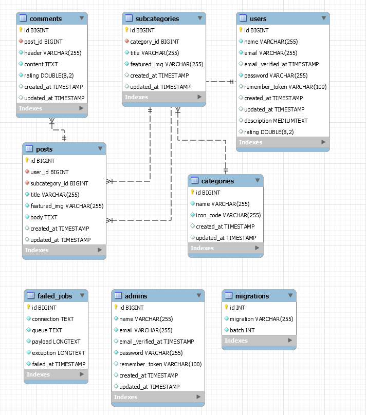

# Freeloaders documentation

### About

"Freeloaders" a responsive website for reading and posting offers from freelancers, made as an educational project for "Vytauto Didžojo Universitetas" a.k.a VDU.

### Sitemap

- [Homepage](images/freeloaders_homepage.png)
    - [Category subcategory page](images/freeloaders_subcategory_page.png)
        - [Subcategory posts page](images/freeloaders_posts_page.png)
            - [Post page](images/freeloaders_post_page.png)
- [Login page](images/freelancers_login_page.png)
    - [User dashboard page](images/freeloaders_dashboad_page.png)
        - [Create new post](images/freelancer_dashboard_create_post_page.PNG)
        - [Show all posts](images/freelancers_dashboard_posts_page.PNG)
            - [Create new post](images/freelancer_dashboard_create_post_page.PNG)
            - Delete post
            - [Edit post](images/freelancers_dashboard_edit_post_page.PNG)
            - [Show post](images/freelancers_dashboard_view_post_page.PNG)
                - [Edit post](images/freelancers_dashboard_edit_post_page.PNG)
                - [Show post](images/freelancers_dashboard_view_post_page.PNG)
- [Register Page](images/freeloaders_registration_page.png)
    - [User dashboard page](images/freeloaders_dashboad_page.png)
    
### Database

##### Default Configuration
- Connection: mysql
- Host: 127.0.0.1
- Port: 3306
- Database name: freeloaders
- Username: root
- Password: root

Configuration file is located in project root directory, named as ".env", but if it does not exist then default configuration are used from [config](../config) directory.

##### Database Tables

- Tables Model
    - 

* All tables and their relationships are defined in php code files stored at [database/migrations](../database/migrations) directory.
* All rows that were used in testing are defined in php code files stored at [database/seed](../database/seeds) directory.

### Authentication

##### User Registration

Front-end process
- User must provide the following information:
    - Username
    - Email address
    - Password
- After submitting registration data, user must verify their email by pressing on verification link.

Back-end process
- Password gets encrypted and then stored in the database along with email address and username.
- Additional data gets created along with the user submit:
    - Timestamps for creation, update and email verification.
    - Password recovery token

##### User Login Process

- Go to login page "/login" if regular user, "/admin/login" if administrator.
- Submit email and password used for registration.

### Project Structure

##### Front-end

- All web pages that are displayed to the end user are stored in [resources/views](../resources/views) directory.
- All custom-made and local imported scripts are stored in [public/js](../public/js) directory. The [app.js](../public/js/app.js) script contain all script assets that were imported by [npm](https://www.npmjs.com/).
- All custom-made and local imported stylesheets are stored in [public/css](../public/css) directory. The [app.js](../public/css/app.css) script contain all stylesheet assets that were imported by [npm](https://www.npmjs.com/).
- All images used be the website are stored in [public/images](../public/images) directory.
- All custom-made fonts are stored in [public/fonts](../public/fonts) directory, local imported in [vendor](../public/fonts/vendor).

##### Back-end

- ##### Models
    The Eloquent ORM included with Laravel provides a beautiful, simple ActiveRecord implementation for working with your database. Each database table has a corresponding "Model" which is used to interact with that table. Models allow you to query for data in your tables, as well as insert new records into the table.
    
    Models are stored in [app](../app) directory and follow a strict naming convention. A model should be in singular, no spacing between words, and capitalised.
    - Good examples: User (\App\User or \App\Models\User, etc), ForumThread, Comment.
    - Bad examples: Users, ForumPosts, blogpost, blog_post, Blog_posts.
    
- ##### Controllers
    Instead of defining all of your request handling logic as Closures in route files, you may wish to organize this behavior using Controller classes. Controllers can group related request handling logic into a single class.
    
    Controllers are stored in the [app/Http/Controllers](../app/Http/Controllers) directory and follow a strict naming convention.
    First character uppercase followed by the word "Controller". Ex. "PostController".
    
    In addition, for normal CRUD operations, they should use one of the following method names.
    
    Verb        | URI                 | Typical Method Name   | Route Name
    ---         | ---                 | ---                   | ---
    GET         | /posts              | index()               | post.index
    GET         | /posts/create       | create()              | post.create
    POST        | /posts              | store()               | post.store
    GET         | /posts/{post}       | show()                | post.show
    GET         | /posts/{post}/edit  | edit()                | post.edit
    PUT/PATCH   | /posts/{post}       | update()              | post.update
    DELETE      | /posts/{post}       | destroy()             | post.destroy
    
### Security

Laravel comes with the following default security measures:
- **Cross Site Request Forgery**
, also known as one-click attack or session riding and abbreviated as CSRF or XSRF,
is a type of malicious exploit of a website where unauthorized commands are transmitted from a user that the web application trusts.
- **Cross Site Scripting**,
a type of computer security vulnerability typically found in web applications. XSS attacks enable attackers to inject client-side scripts.
- **SQL Injection**,
is the placement of malicious code in SQL statements, via web page input.

    
### Tools and Technologies

The following tools and technologies were used in the process of making this project.

##### Front-end

- [Bootstrap](https://getbootstrap.com/),
the world’s most popular front-end open source toolkit,
featuring Sass variables and mixins, responsive grid system, extensive prebuilt components, and powerful JavaScript plugins.
- [Npm](https://www.npmjs.com/),
the world's largest Software Registry. The registry contains over 800,000 code packages.
Open-source developers use npm to share software.
- [Font Awesome](https://fontawesome.com/),
the web's most popular icon set and toolkit.
- [WYSIWYG editor](https://www.tiny.cloud/),
a tool to easily implement WYSIWYG editing in web pages.

##### Back-end

- [Laravel](https://laravel.com/), a web application framework with expressive, elegant syntax.
We’ve already laid the foundation — freeing you to create without sweating the small things.
- [Composer](https://getcomposer.org/), a dependency manager for PHP.
- [PhpStorm](https://www.jetbrains.com/phpstorm/), is perfect for working with Symfony, Laravel, Drupal, WordPress,
Zend Framework, Magento, Joomla!, CakePHP, Yii, and other frameworks
- [Laravel IDE Helper](https://github.com/barryvdh/laravel-ide-helper), generates helper files that enable your IDE to provide accurate auto-completion.
Generation is done based on the files in your project, so they are always up-to-date.
- [Laravel Inverse Seed Generator](https://github.com/orangehill/iseed), is a Laravel package that provides a method to generate a new seed file based on data from the existing database table.
- [HTML Purifier for Laravel](https://github.com/mewebstudio/Purifier), a tools used to clean html code before sending it to database.

## Conclusion

##### Abstract

Laravel is a resourceful framework that greatly simplifies creation of websites by removing the need of boilerplate code for most common functionality.
The ability to create layouts and components using laravel syntax greatly reduces code duplication,
allowing faster prototyping and more reliable future changes while keeping the code user-friendly.

##### Project Features Checklist

- [x] Categorize offers / services into major categories and more specific subcategories.
- [x] Login password recovery through email.
- [x] Global top navigation bar.
- [x] Side navigation bar for subcategories and posts.
- [x] Admin page for creating subcategories and other...
- [x] Register freelancers necessary to allow posting offers.
- [x] Offer / service post should allow customizing text style (WYSIWYG editor).
- [x] Allow freelancers to post offers / services (once logged-in).
- [x] Protection from common security threats such as “SQL injection”, "Cross Site Request Forgery", others...
- [ ] Add more features to WYSIWYG editor, such as tables and slideshows.
- [ ] FAQ. Mostly user instruction.
- [ ] Tech-support forms.
- [ ] Allow customers to leave a review of offers / services they’ve taken (once logged-in).
- [ ] Website supports multiple languages.
- [ ] Freelancer post multi-language versions.
- [ ] Instant-messaging platform for freelancer / customer communication.

